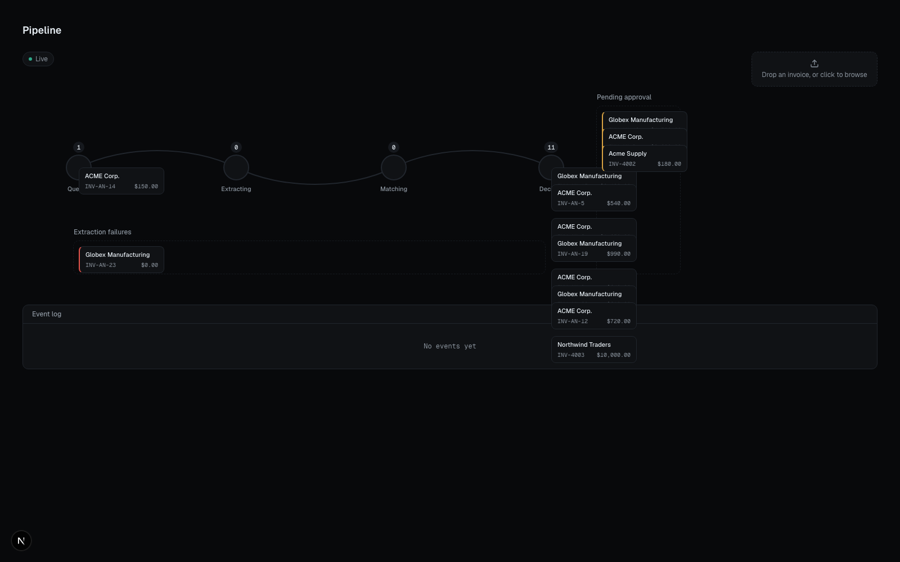
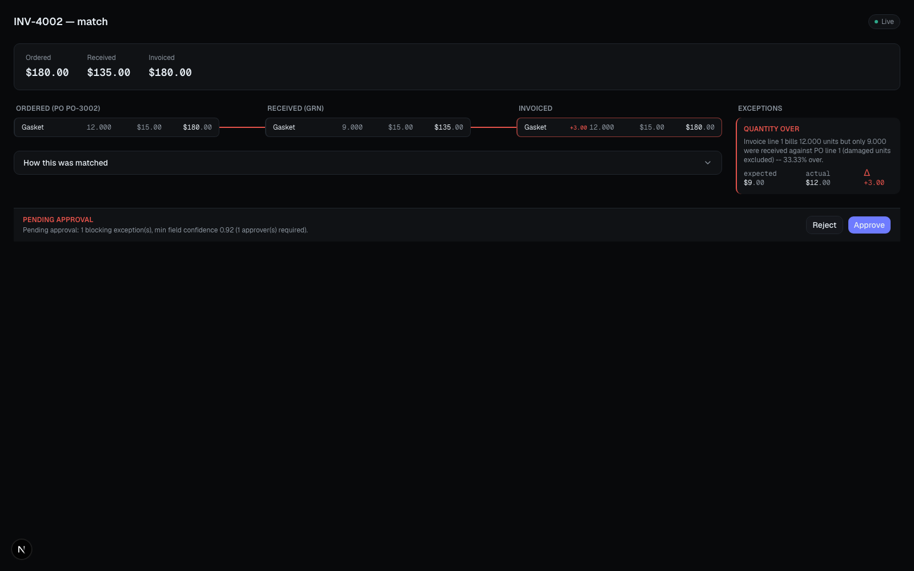
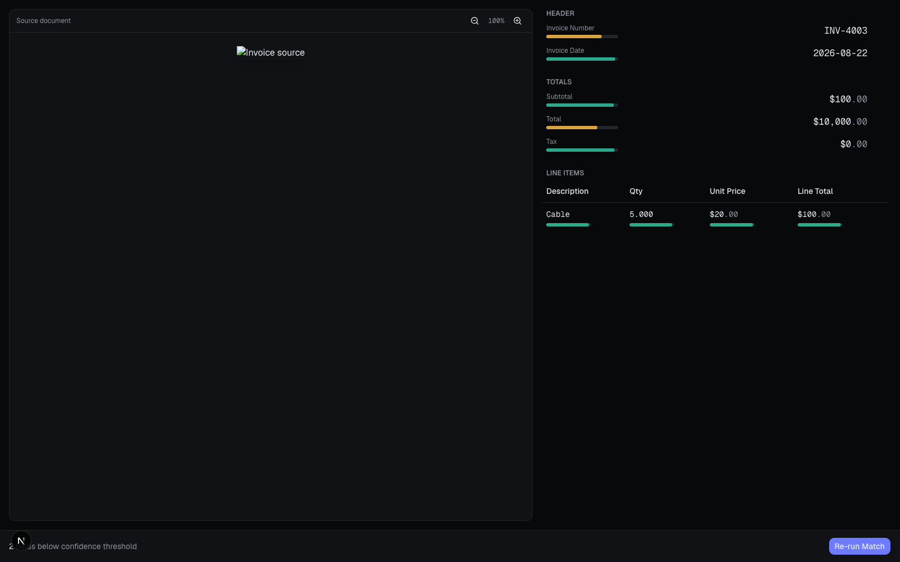
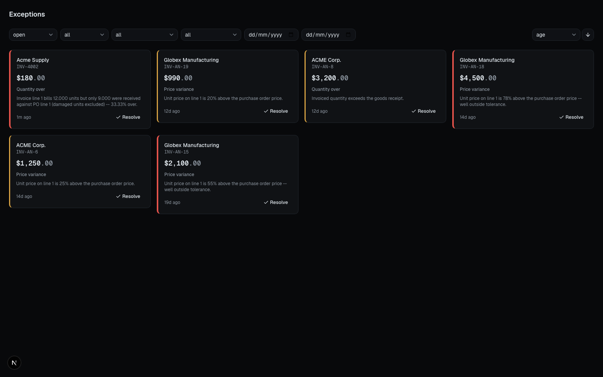
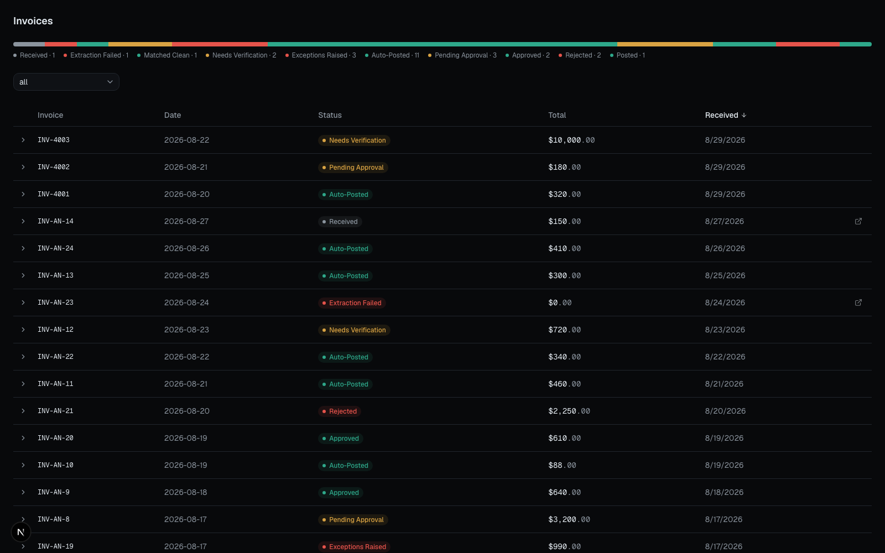
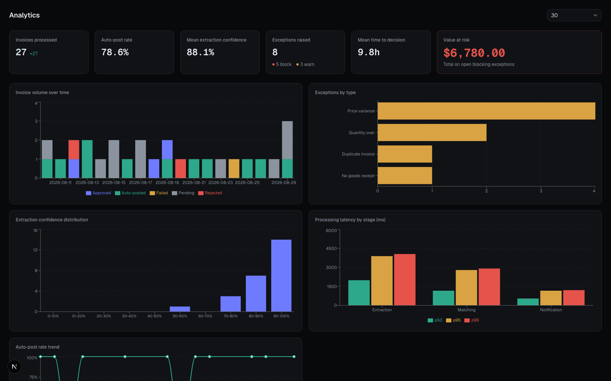
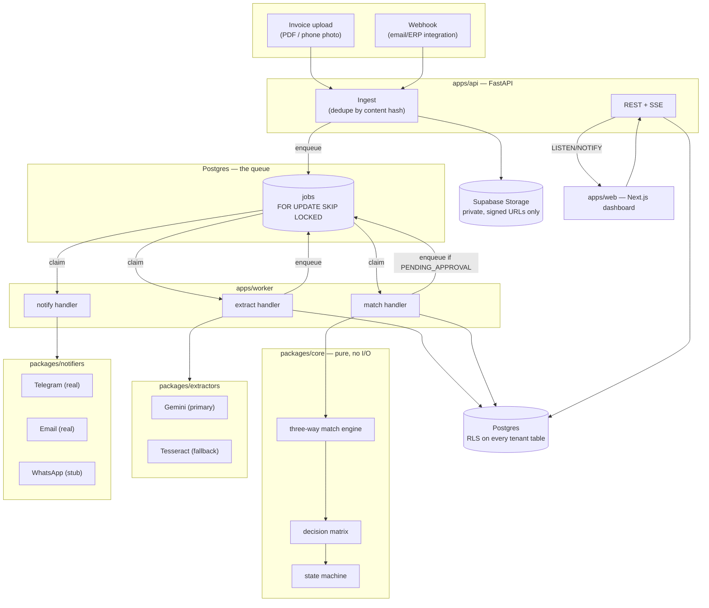

# Trident Oracle

An invoice intake and three-way match engine. Vendors send invoices as PDFs or phone photos;
the system extracts structured data, matches it against the corresponding Purchase Order and
Goods Receipt, flags discrepancies, and routes exceptions to a human approver via Telegram.
Clean, high-confidence, low-value invoices post automatically.

## The problem, in two sentences

Every procurement department checks incoming vendor invoices against what was actually ordered
and what actually arrived before paying them — today, almost always by a person squinting at
three documents side by side. Trident Oracle reads the invoice, runs that same comparison in
under a second, and only interrupts a human for the invoices that actually look wrong.

## What "three-way matching" means, and why it's the whole point

A vendor sends an invoice. There are two other documents that already exist for that same
purchase: the **Purchase Order** (what you agreed to buy) and the **Goods Receipt** (what your
warehouse actually signed for on arrival). Three-way matching means checking the invoice
against *both*, not just the PO.

That "both" is the entire reason this is harder than it sounds. A two-way check (invoice vs.
PO) only tells you the invoice matches what was *ordered* — it says nothing about what actually
showed up. A vendor can ship 9 units, bill for the 12 that were originally ordered, and a
two-way check waves it straight through. Trident Oracle checks quantity against the **goods
receipt**, not the purchase order (`packages/core/core/matching/three_way.py`) — you pay for
what arrived, not what you asked for. That single design decision, and its real cost (it
depends entirely on receiving staff recording accurate quantities), is written up in
`docs/DECISIONS.md`, ADR-005.

## What it looks like

**The pipeline** — every invoice's live journey from upload through extraction, matching, and
decision, driven by real database events over SSE, not a fake animation:



**The comparison screen** — Ordered vs. Received vs. Invoiced, side by side, with the exact
exception that got raised and why:



**Field verification** — when extraction confidence is too low to trust, before any match
result is allowed to matter (`docs/DECISIONS.md`, ADR-004):



<details>
<summary>More screens (exceptions queue, invoice list, analytics)</summary>





</details>

## Architecture



Full technical write-up — data model, state machine, queue semantics, security model, the
matching algorithm stage by stage — is in `docs/ARCHITECTURE.md`.

## Setup: clone to running

Verified by actually doing this, from a clean copy of this repo, immediately before writing
this section — not assumed.

**Prerequisites**

- Node.js 20+ with `pnpm` (`corepack enable pnpm`)
- Python 3.11+ with [`uv`](https://docs.astral.sh/uv/)
- Docker (or any Postgres 16+ instance) for local development
- A Supabase project (Postgres + Storage) — **required even for local development**. There is
  no local-only mode: `apps/worker` calls `get_storage()` at startup and refuses to run without
  real `SUPABASE_URL`/`SUPABASE_SERVICE_KEY` (confirmed by actually starting it without them).
  `apps/api` and `apps/web` can run and serve already-seeded, read-only data without Storage
  configured — only file upload and the worker need it.

```bash
# Install JS workspace dependencies (apps/web)
pnpm install

# Install Python workspace dependencies -- every workspace member is already
# listed in pyproject.toml, so plain `uv sync` (no --all-packages flag) installs
# all of them. Confirmed: `uv sync --all-packages` also works but is redundant.
uv sync

# Copy env templates and fill in real values
cp .env.example .env
cp apps/web/.env.example apps/web/.env.local
```

**Database**

```bash
# Apply migrations, in order, against your Supabase project's direct connection
# (see db/README.md for the Supabase CLI alternative and the full RLS role story)
for f in db/migrations/*.sql; do
  psql "$DATABASE_URL" -v ON_ERROR_STOP=1 -f "$f" || break
done

# Seed a realistic demo dataset (idempotent -- safe to rerun)
RESET_SCRIPT_DATABASE_URL=<service-role connection> uv run python db/seed/seed.py
```

**Running**

```bash
# Frontend
pnpm --filter web dev

# API
uv run --package api uvicorn api.main:app --reload

# Worker -- EXTRACTOR_BACKEND=tesseract works with zero API keys; the default
# (unset) tries Gemini first and needs GEMINI_API_KEY
EXTRACTOR_BACKEND=tesseract uv run --package worker python -m worker.main
```

**Testing and linting**

```bash
uv run pytest                          # 578 passed, 88 skipped, last run
uv run ruff check . && uv run mypy apps packages
pnpm --filter web test && pnpm --filter web lint
```

Want to see the four scenarios above running live end to end? `docs/DEMO.md` is a full
minute-by-minute runbook with staged fixture files and a reset script.

## Benchmarks

`docs/BENCHMARKS.md` is generated exclusively by real `python -m evals run`/`compare`
invocations against real data — never hand-edited, and every run is kept even when the numbers
are disappointing. Headline, from the most recent real run (40 documents, real downloaded
DocILE data, `TesseractExtractor`):

| Field | F1 | Notes |
|---|---|---|
| `header.total` | 80.6% | Large, unambiguous number — OCR's best case |
| `header.subtotal` | 60.0% | Only measurable after a real bug fix mid-project (see below) |
| `header.invoice_date` | 15.8% | Free-text dates confuse label-based extraction |
| `header.vendor_name` | — (0% recall) | Not attempted at all — no reliable label exists |
| Line items (qty/price/description) | ~0.2% F1 | Near-total failure — see below |

**Read this plainly, not generously.** These are Tesseract (local OCR, zero network calls, zero
API cost) numbers — this project's actual production default is Gemini (a vision-language
model) with Tesseract as the free-tier-quota *fallback*, and no Gemini run exists in this
environment (no API key). This table is "what raw OCR gets you with zero semantic
understanding of the document," the baseline the real system exists to beat, not a claim about
the deployed system's real-world accuracy. Line-item recognition in particular is a genuine,
serious weak point of the OCR fallback path specifically — a heuristic column-position detector
has no idea what a table actually is, and it shows.

Three real bugs were found (two fixed, one documented but not yet fixed) while producing these
numbers, entirely by actually running real invoices through the real code rather than reading
it — see `docs/BENCHMARKS.md`'s own preamble for the full, honest account, including a
concurrency bug in the benchmark harness itself.

## What's not built yet

This is deliberately incomplete, not accidentally. Framed with reasoning in `docs/ROADMAP.md`:

- **No automatic PO/vendor linkage — the most significant gap on this list.** No extraction
  backend even attempts to read a PO reference off a document (`InvoiceHeader` has no
  `po_number` field), and nothing else resolves `invoices.po_id`/`vendor_id` either. Every
  invoice ingested through the real upload or webhook path — no exceptions — gets `po_id =
  NULL` forever, and the matching engine never runs a real match on it. The only invoices that
  have ever had a PO in this codebase are rows written directly by the seed scripts, bypassing
  ingestion entirely; `demo/link_po.py` is a human-supplied mapping (a PO number typed on the
  command line by someone who already knows the answer), not a scaled-down version of a real
  lookup. See `docs/ROADMAP.md` for exactly what a real version needs and why it's close to
  Phase 1 scope, not a deferred nice-to-have.
- **The full rule engine** — one fixed tolerance policy per tenant today, not a rule DSL or
  per-vendor overrides.
- **Escalation ladders** — a pending approval notifies once and waits; nothing reminds,
  escalates, or reassigns based on how long it's sat.
- **Multi-tenant UI** — RLS is genuinely multi-tenant end to end; the frontend has no tenant
  switcher.
- **WhatsApp notifications** — a documented stub (`WhatsAppNotifier.send()` raises
  `NotImplementedError` on purpose), not a broken implementation. Telegram and email are real.
  See `docs/DECISIONS.md` ADR-006 for exactly why, including the non-engineering (Meta Business
  verification, message templates) parts of what's missing.
- **ERP posting integration** — `POSTED` is a legal state in the state machine; nothing ever
  transitions an invoice into it. Fully unbuilt, not partially built, pending a real ERP account
  to integrate against honestly rather than guessing at an interface.

## Documentation

- `docs/ARCHITECTURE.md` — data model, state machine, queue semantics, security model, the
  matching algorithm stage by stage
- `docs/DECISIONS.md` — ADR log, one entry per real trade-off, upsides and downsides both
- `docs/DEMO.md` — 15-minute demo runbook with staged fixtures and a reset script
- `docs/ROADMAP.md` — what's deliberately deferred, and what would trigger building it
- `docs/BENCHMARKS.md` — real, accumulating extraction-accuracy measurements
- `db/README.md` — migrations, the three-role RLS security model, known scope limits
