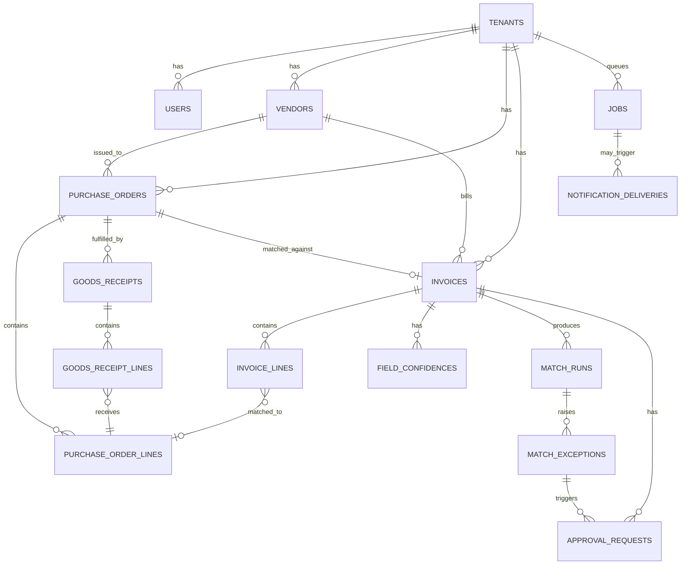
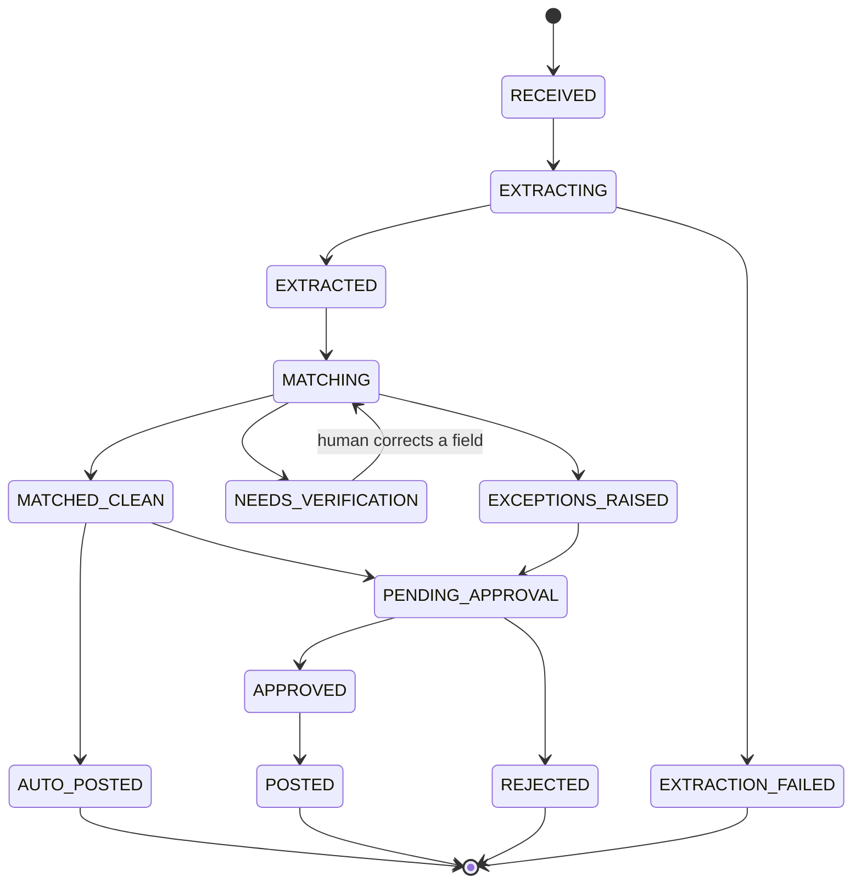

# Trident Oracle — Architecture

This is a technical description of what is actually built, verified against the code and the
live schema as of this writing. Where the system has a known gap or a rough edge, it's called
out in place rather than left implicit — see `docs/ROADMAP.md` for what's deliberately deferred
and `docs/DECISIONS.md` for why the major trade-offs were made the way they were.

---

## 1. What the system does

Vendors send invoices as PDFs or phone photos. Trident Oracle extracts structured data from
them, checks it against the corresponding Purchase Order (what was ordered) and Goods Receipt
(what actually arrived), and flags anything that doesn't reconcile. Clean, confident,
low-value invoices post automatically; everything else queues for a human decision, delivered
over Telegram.

```
Invoice (PDF/photo)
        │
        ▼
   RECEIVED ──▶ EXTRACTING ──▶ EXTRACTED ──▶ MATCHING ──▶ decide()
                    │                                        │
                    ▼                                        ▼
            EXTRACTION_FAILED                  AUTO_POSTED / PENDING_APPROVAL
                                                    / NEEDS_VERIFICATION
```

---

## 2. Service topology

```
trident-oracle/
├── apps/
│   ├── web/        Next.js 15 (App Router) — dashboard
│   ├── api/        FastAPI — REST + webhook receiver + SSE
│   └── worker/     Python poll loop — claims and executes jobs
├── packages/
│   ├── core/           Domain logic. No I/O. Matching engine, state machine,
│   │                   decision matrix, queue backoff math.
│   ├── extractors/     GeminiExtractor · TesseractExtractor · MockExtractor · fallback chain
│   ├── notifiers/       TelegramNotifier · EmailNotifier · WhatsAppNotifier (stub) · MockNotifier
│   ├── storage/         SupabaseStorage · in-memory Storage (tests)
│   ├── approval_tokens/ token generation/hashing, shared by apps/api
│   └── evals/           Benchmark harness — DocILE / CORD / SROIE
├── db/
│   ├── migrations/     29 numbered SQL files, applied in order, never edited after commit
│   └── seed/            db/seed/seed.py — deterministic demo dataset
└── docs/
```

`packages/core` has no I/O — no database calls, no HTTP, no file reads. Given a PO, a GRN, an
invoice, and a tolerance policy, the matching engine returns a list of exceptions and nothing
else. This is the one rule in this codebase that nothing is allowed to erode, and it's what
makes the matching engine's 91-test suite (`packages/core/tests/matching/`) run in well under
a second with zero fixtures beyond in-memory dataclasses.

---

## 3. Data model

Multi-tenant from the first migration. Every tenant-scoped table carries `tenant_id` and an
RLS policy (see §7); Row Level Security, not application code, is the authorization boundary.



### Procurement (ground truth the invoice is checked against)

```sql
vendors(id, tenant_id, name, normalized_name, tax_id, email, created_at)
purchase_orders(id, tenant_id, vendor_id, po_number, issued_at, currency,
                subtotal, tax, total, status, created_at)
purchase_order_lines(id, po_id, line_no, sku, description, normalized_description,
                     qty_ordered, unit_price, tax_rate, line_total)
goods_receipts(id, tenant_id, po_id, grn_number, received_at, received_by)
goods_receipt_lines(id, grn_id, po_line_id, qty_received, condition, notes)
  -- condition: 'good' | 'damaged' | 'partial' -- damaged units are excluded
  -- from qty_received when the matching engine checks quantity (§5, stage 4a)
```

### Ingestion & extraction

```sql
invoices(id, tenant_id, vendor_id NULL, po_id NULL,
         invoice_number, invoice_date, due_date, currency, subtotal, tax, total,
         source_channel,      -- 'upload' | 'email' | 'webhook'
         source_file_path,    -- Supabase Storage path, private bucket, signed URL only
         content_hash,        -- SHA-256 of raw bytes; UNIQUE(tenant_id, content_hash)
         extraction_backend,  -- 'gemini' | 'tesseract' | 'mock'
         overall_confidence,  -- min(), never mean(), of every field's confidence — §5
         status, created_at, updated_at)

invoice_lines(id, invoice_id, line_no, description, normalized_description,
              qty, unit_price, line_total,
              matched_po_line_id NULL, match_method NULL, match_confidence NULL)
  -- match_method: 'sku' | 'fuzzy' | 'llm' | 'unmatched'

field_confidences(id, invoice_id, field_path, confidence, bbox JSONB, raw_text,
                   human_corrected, corrected_at)
  -- field_path: 'header.total' | 'lines[2].qty', etc. bbox drives the verification
  -- screen's box-overlay animation. human_corrected/corrected_at (0023) record that
  -- a human, not the extractor, is now the source of truth for a field -- the
  -- extractor's own confidence score is left untouched, not overwritten.
```

`invoices.content_hash` has a `UNIQUE(tenant_id, content_hash)` constraint — a byte-identical
re-upload is rejected at ingestion, before extraction or matching ever runs
(`apps/api/api/ingest.py::find_invoice_by_content_hash`), returning the existing invoice's id
rather than a new row. This is a different, cheaper mechanism than the matching engine's own
duplicate-detection stage (§5, stage 1), which compares against a candidate set of *prior*
invoices for the same tenant and catches near-duplicates the hash check can't (a rescanned
copy, a resend with the same invoice number but different file bytes).

### Queue & delivery

```sql
jobs(id, tenant_id, job_type, payload JSONB, status, attempts, max_attempts,
     idempotency_key UNIQUE, run_after, locked_at, locked_by, last_error,
     created_at, updated_at)
  -- job_type: 'extract' | 'match' | 'notify' | 'post'
  -- status: 'queued' | 'running' | 'done' | 'failed' | 'dead'

dead_letters(id, job_id, tenant_id, payload JSONB, final_error, created_at)

notification_deliveries(id, tenant_id, channel, recipient, idempotency_key UNIQUE,
                        status, attempts, next_retry_at, provider_message_id,
                        error, sent_at, invoice_id, exception_id)
```

### Matching & approvals

```sql
tolerance_policies(id, tenant_id, name, is_active, rules JSONB, version)
  -- rules: {price_variance_pct, qty_tolerance_pct, auto_approve_below,
  --         dual_approval_above, min_field_confidence, duplicate_window_days}

match_runs(id, invoice_id, policy_version, result, reason, duration_ms, executed_at)
  -- result: 'clean' | 'exceptions' | 'blocked'
  -- reason (0024): core.decision.Decision.reason, persisted so a historical run
  -- stays explicable without recomputing decide() against data that may have changed

match_exceptions(id, match_run_id, invoice_id, exception_type, severity,
                 po_line_id NULL, invoice_line_id NULL,
                 expected_value, actual_value, delta, delta_pct,
                 status, resolved_by, resolved_at, resolution_note)
  -- exception_type: NO_PO | NO_GRN | DUPLICATE_INVOICE | SUSPECTED_DUPLICATE |
  --                 PRICE_VARIANCE | QTY_SHORT | QTY_OVER | UNMATCHED_LINE |
  --                 ARITHMETIC_ERROR | TAX_MISMATCH | DATE_ANOMALY
  -- severity: 'info' | 'warn' | 'block'

approval_requests(id, tenant_id, invoice_id, exception_id NULL,
                  token_hash,   -- SHA-256 hex only. Raw token never stored.
                  channel, recipient, expires_at, consumed_at,
                  decision NULL, decided_by, decided_at, decision_note)

audit_log(id, tenant_id, actor_type, actor_id, action, entity_type, entity_id,
          before JSONB, after JSONB, created_at)
  -- append-only: a DB trigger raises on UPDATE or DELETE (§7)
```

### Evaluation (not tenant-scoped — internal quality measurement, not business data)

```sql
eval_runs(id, dataset, backend, model_version, sample_count, started_at, finished_at,
          mean_latency_ms, total_estimated_cost_usd, latency_p50/p95/p99_ms,
          line_item_precision/recall/f1, line_item_n_ground_truth/predicted/matched)
eval_results(id, eval_run_id, field_path, precision, recall, f1, exact_match_rate,
             mean_confidence, mean_latency_ms, mean_absolute_error, within_tolerance_rate, n)
eval_run_calibration(id, eval_run_id, bucket_low, bucket_high, n, mean_confidence, actual_accuracy)
eval_run_documents(id, eval_run_id, doc_id, ground_truth JSONB, extraction_result JSONB,
                   mismatch_count, thumbnail_path, mime_type)
  -- the /benchmarks failure gallery's sort key: highest mismatch_count first
```

---

## 4. Invoice state machine

Every status change goes through `packages/core/core/state_machine.py::validate_transition()` —
no code anywhere sets `invoices.status` directly. An illegal transition raises
`InvalidStateTransition`; it never silently no-ops.



`NEEDS_VERIFICATION → MATCHING` is the only backward edge in the graph: a human corrects a
low-confidence field on the verification screen, and the invoice re-enters the matching
pipeline from scratch rather than resuming mid-pipeline — a corrected field can change which
PO line matches, so nothing downstream of extraction is trustworthy to keep.

Every transition writes to `audit_log` (`before`/`after` JSONB capturing the full entity state
either side of the change).

---

## 5. The matching engine

Pure function, `packages/core/core/matching/three_way.py::run_three_way_match()`. Cheapest and
highest-value checks run first, and a hard/exact duplicate short-circuits everything after it —
there's no point spending a fuzzy-matching pass or an LLM call reconciling an invoice that's
about to be rejected outright.

**Stage 1 — Duplicates** (`duplicates.py`), checked per prior invoice, stopping at the first hit:

1. **Hard duplicate** — identical `content_hash` against a prior invoice in the candidate set →
   `DUPLICATE_INVOICE` (block), short-circuits the whole pipeline.
2. **Exact duplicate** — same `vendor_id` + `invoice_number` (case-insensitive, whitespace-
   stripped) → `DUPLICATE_INVOICE` (block), also short-circuits.
3. **Suspected duplicate** — same vendor (by `normalize_vendor_name`, which lowercases, strips
   punctuation, and drops legal-entity suffixes like "Corp"/"Ltd"/"Inc" so "ACME Corp.",
   "Acme Corporation", and "ACME CORP" all collapse to `acme`), total within 0.5%, invoice date
   within `policy.duplicate_window_days`, and ≥70% of line descriptions fuzzy-matching (token-
   set ratio ≥ 0.80) → `SUSPECTED_DUPLICATE` (warn). Does **not** short-circuit — rides along
   as one more finding.

**Stage 2 — Document linkage.** No PO → `NO_PO` (block), and the pipeline stops there (no PO
lines means nothing left to check against). No GRN, but a PO exists → `NO_GRN` (block), but the
pipeline continues — line matching and price checks are still useful even though quantity can't
be verified against nothing.

**Stage 3 — Line matching** (`line_matcher.py`), a cascade, cheapest and most-certain first,
every tier enforcing a strict one-to-one pairing (a PO line claimed by one invoice line can't
also be claimed by a later tier):

1. **Exact SKU** — the PO line's SKU appears as a whole token in the invoice line's description
   → `match_method='sku'`, confidence 1.0.
2. **Fuzzy** — normalized token-set ratio ≥ 0.88 (lowercase, strip punctuation, sort tokens) →
   `'fuzzy'`, confidence = the score. Competing matches for the same PO line resolve greedily by
   descending score.
3. **LLM fallback** — every invoice line still unmatched after 1–2, batched into a single call
   (never one call per line — the free-tier Gemini quota this project runs on is 10
   requests/minute) → `'llm'`, confidence = the model's own reported score.
4. Still unmatched → `UNMATCHED_LINE` (block) — billed for something never ordered.

**Stage 4 — Per matched line:**

- **Quantity**: `invoice.qty` vs **`grn.qty_received`** (damaged-condition receipt lines
  excluded), never `po.qty_ordered`. This is the entire point of three-way matching — you pay
  for what arrived, not what you asked for. Over tolerance and over → `QTY_OVER` (block, you're
  being billed for phantom goods); over tolerance and under → `QTY_SHORT` (info, still worth a
  human glance). No GRN → this check is skipped entirely, not estimated.
- **Price**: `invoice.unit_price` vs `po.unit_price`. Within `price_variance_pct` → no finding;
  up to 2× that tolerance → `PRICE_VARIANCE` (warn); beyond 2× → `PRICE_VARIANCE` (block).

**Stage 5 — Unmatched invoice lines** left over from stage 3 → `UNMATCHED_LINE` (block).

**Stage 6 — Document arithmetic**, unconditional, even on an invoice that looks otherwise
spotless: `Σ(line_total) == subtotal` (±0.01). (`subtotal + tax == total` and
`line_total == qty × unit_price` per line are *also* checked here, but both are already enforced
by `Invoice`'s and `InvoiceLine`'s own constructors — structurally unreachable for a valid
domain object, kept only as a last checkpoint in case that invariant is ever relaxed.) Any
failure → `ARITHMETIC_ERROR` (block) — a total that doesn't reconcile means the extraction is
wrong regardless of what confidence the model reported for it.

**Stage 7 — Tax and date sanity**: effective tax rate (`tax / subtotal × 100`) compared against
a configurable set of expected slabs (default 0/5/12/18/28%) within an epsilon → `TAX_MISMATCH`
(warn) if it matches none. Invoice dated after today, or dated before the PO was issued →
`DATE_ANOMALY` (warn).

The result is `clean` (zero findings), `exceptions` (findings present, none `block` severity —
wait, any severity present makes it non-clean; `blocked` is reserved for when at least one
finding is `block` severity), or `blocked`.

---

## 6. The decision layer

`packages/core/core/decision.py::decide()` sits on top of the match result and decides where
the invoice goes next — `AUTO_POST`, `PENDING_APPROVAL`, or `NEEDS_VERIFICATION`.

|                    | all fields ≥ `min_field_confidence` | any field < `min_field_confidence` |
|--------------------|--------------------------------------|-------------------------------------|
| no exceptions      | total < `auto_approve_below`: **AUTO_POST**<br>else: **PENDING_APPROVAL** | **NEEDS_VERIFICATION** |
| warn only          | **PENDING_APPROVAL** | **NEEDS_VERIFICATION** |
| any block          | **PENDING_APPROVAL** (2 approvers if total > `dual_approval_above`) | **NEEDS_VERIFICATION** |

**Confidence gating is checked first, before the match result, unconditionally.** A clean match
built on a field the extractor wasn't confident about isn't evidence of anything — "zero
exceptions" only means nothing looked wrong when compared against fields that might themselves
be misread. `extraction_confidence` here is the invoice's `overall_confidence`, computed in
`apps/worker/worker/extract_handler.py::compute_overall_confidence()` as the **minimum** field
confidence, never the mean:

```python
def compute_overall_confidence(confidence: dict[str, float]) -> float | None:
    """The MINIMUM field confidence, not the mean. A mean lets one badly-read
    field hide behind many easy, high-confidence ones (e.g. nine correctly-read
    line descriptions averaging out one garbled total). The weakest field is
    what should determine whether a human needs to look."""
    return min(confidence.values()) if confidence else None
```

`None` (not `0`) when there are no confidence scores at all — also routes to
`NEEDS_VERIFICATION`. See `docs/DECISIONS.md` for the full trade-off (this also means one
irrelevant low-confidence field, e.g. a smudged PO reference nobody reads, can force a review
an accuracy-weighted score wouldn't).

The 2-approver rule (`total > policy.dual_approval_above`) applies uniformly to every
`PENDING_APPROVAL` outcome, not only the "any block" row — a large clean invoice sitting above
the auto-approve threshold is exactly as financially risky as a large invoice with a blocking
exception, and the sign-off requirement tracks the money at stake, not which row of the matrix
produced the outcome.

---

## 7. Queue semantics

Postgres is the queue — `FOR UPDATE SKIP LOCKED`, no Redis, no Celery, no broker.

**Claiming work** (`apps/worker/worker/db.py::claim_next`):

```sql
UPDATE jobs SET status='running', locked_at=now(), locked_by=%(worker_id)s
WHERE id = (
    SELECT id FROM jobs
    WHERE status='queued' AND run_after <= now()
    ORDER BY created_at
    FOR UPDATE SKIP LOCKED
    LIMIT 1
)
RETURNING *
```

`SKIP LOCKED` means any number of worker processes can call this concurrently and never claim
the same row — no coordination beyond the database itself. FIFO by `created_at`, not priority.
This connection is authenticated as `queue_claimer` (see §8), which has `BYPASSRLS` scoped to
exactly `jobs` and `dead_letters` — it can see across every tenant's queue (`claim_next` has no
`tenant_id` filter by design) without weakening RLS anywhere that holds real business data. Once
a job is claimed, its *handler* runs on a separate, ordinary `app_role` connection with
`app.tenant_id` set to that job's own tenant — RLS applies fully there.

**Retry and backoff** (`packages/core/core/queue/backoff.py::compute_backoff`):

```
delay = (2^attempts × base_delay) ± random(0, base_delay)
```

`base_delay` defaults to 60s, `attempts` is the post-increment count (first failure passes
`attempts=1`). Floored at zero if jitter would push it negative, so a job can never be
immediately reclaimed in a tight retry loop. `max_attempts` defaults to 3 (the `jobs` table's
own column default); the `notify` job type is enqueued with `max_attempts=5` explicitly
(`worker/match_handler.py`) since a failed notification is cheap to retry and expensive to give
up on.

**Dead-lettering**: on `fail()`, once `attempts >= max_attempts`, the row is copied to
`dead_letters` and `jobs.status` set to `'dead'` — otherwise it's rescheduled with the backoff
above.

**Stale-lock reaping** (`reap_stale_locks`): any `running` job whose `locked_at` is older than
10 minutes (`WORKER_STALE_LOCK_MINUTES`) returns to `queued`, `attempts` incremented (counts
toward dead-lettering, but does **not** get exponential backoff applied — it's immediately
eligible again). Run on every poll-interval tick of the worker's own main loop (default 5s), not
an external cron — a worker that crashes mid-job must not strand the work forever.

**Idempotency**: every job carries a UNIQUE `idempotency_key`
(`sha256(tenant_id + content_hash)` for extraction, `sha256(tenant_id + exception_id + recipient
+ channel)` for notification). `enqueue()`'s upsert (`ON CONFLICT ... DO UPDATE SET
idempotency_key = jobs.idempotency_key`, a no-op self-assignment) always returns the existing
row rather than creating a duplicate or raising — a retried notification after a timeout must
not send a second Telegram message.

**Pipeline events**: every invoice status change already goes through exactly one of two SQL
statements (insert at `RECEIVED`, or an `UPDATE ... SET status = ...` gated by
`validate_transition`). A trigger (`0022_pipeline_events.sql`) on those two statements calls
`pg_notify('trident_pipeline_events', ...)`; `apps/api/api/events.py` `LISTEN`s on that channel
and republishes to `GET /v1/events/stream` (SSE) — the pipeline dashboard's live rail is driven
by real database state changes, not a polling loop or a synthetic animation.

---

## 8. Security model

| Concern | Mechanism |
|---|---|
| Tenant isolation | RLS on every tenant-scoped table, `USING (tenant_id = current_setting('app.tenant_id', true)::uuid)`. Unset `app.tenant_id` → `NULL` → denied by default, not an open door. Both the API (per-request) and the worker's handler connection (per-job) set it. |
| Three-role split | `app_role` (`NOSUPERUSER NOBYPASSRLS`, ordinary RLS-scoped access — API and worker handlers), `queue_claimer` (`BYPASSRLS`, grants scoped to `jobs`/`dead_letters` only — nothing else to leak), `approval_redeemer` (`NOSUPERUSER NOBYPASSRLS`, identical grants to `app_role` on five tables plus one extra permissive `SELECT` policy on `approval_requests` alone, needed because redeeming a token means looking it up by hash before any `tenant_id` is known). Full reasoning: `db/README.md`'s "Security model" section. |
| File access | Supabase Storage, private bucket, signed URLs only (`SIGNED_URL_EXPIRES_IN_SECONDS = 300`). The `Storage` interface has no public-URL method at all — a backend can't accidentally return one. |
| Webhook authenticity | HMAC-SHA256 over the raw request body + timestamp, constant-time compare (`hmac.compare_digest`), rejected if the timestamp is older than 5 minutes (replay protection). Verified against the *raw* body before any JSON parsing. |
| SSRF hardening | `POST /v1/webhooks/invoices`'s `file_url` fetch resolves the hostname once, rejects any private/loopback/link-local/reserved/multicast address, restricts to `http`/`https`, never follows redirects. (Residual gap: a second DNS lookup at actual connect time could in principle differ from the pre-check — a TOCTOU DNS-rebinding class of issue, not closed.) |
| Approval tokens | 32 random bytes, base64url. Only the SHA-256 hash is ever stored. Single-use enforced by a genuine `SELECT ... FOR UPDATE` row lock, not application control flow. All three failure modes (not found / expired / already used) render the *same* generic message to the client — which one occurred is never distinguishable from outside. |
| Audit integrity | `audit_log` is append-only — a trigger raises on `UPDATE` or `DELETE` against it, unconditionally. |
| Rate limiting | In-memory, per-process, per-client-IP token bucket on upload/webhook/approval endpoints (`apps/api/api/ratelimit.py`) — not cluster-wide; see `db/README.md`'s "Known scope limits". |
| Transport | HSTS, CSP, X-Content-Type-Options, Referrer-Policy, X-Frame-Options on every response from the Next.js app. CSP's `script-src`/`style-src` both carry `unsafe-inline` for reasons specific to this Next.js version — see the comment block in `apps/web/next.config.ts` for why a nonce-based policy was tried and didn't work in practice. |
| Secrets | `.env` never committed; `.env.example` documents every key and which component reads it. |

---

## 9. Extraction

`packages/extractors/extractors/base.py::Extractor` is the interface every backend implements —
one method, `extract(file_bytes, mime_type) -> ExtractionResult`, raising `ExtractionError` on
failure, never a partial result.

- **`GeminiExtractor`** — primary. Model name read from `GEMINI_MODEL` (default
  `gemini-3.6-flash` — see CLAUDE.md's model note), so a future free-tier model rotation is a
  config change, not a code change.
- **`TesseractExtractor`** — local OCR fallback, no network, no quota. Genuinely measured
  against real data in `docs/BENCHMARKS.md`: strong on `header.total` (a large, unambiguous
  number), weak everywhere structure matters (line-item tables), since raw OCR has no semantic
  understanding of a document's layout the way a vision model does.
- **`MockExtractor`** — fixture-backed (`extractors/fixtures/*.json`), ignores the actual file
  bytes entirely. Used throughout the test suite so it never touches the network, and
  selectable in production via `EXTRACTOR_BACKEND=mock` for demos — see `docs/DEMO.md` for the
  one real limitation this has (only one fixture is wired up per process; it cannot serve
  different canned results to different uploads without extending `factory.py`).
- **`FallbackExtractor`** — retries the primary up to `max_retries + 1` times (default 3 total)
  on a `RetryableExtractionError` only; any other exception propagates immediately without
  falling back (fallback exists for transient failures, not to paper over a primary that's
  fundamentally broken). `get_extractor_with_fallback()` wires Gemini → Tesseract, which is what
  `apps/worker/worker/extract_handler.py` actually calls in production.

---

## 10. Notifications

`packages/notifiers/notifiers/base.py::Notifier` — one method, `send(recipient, message,
idempotency_key) -> DeliveryResult`, raising `NotificationError` (permanent) or
`RetryableNotificationError` (transient, safe to retry) on failure.

- **`TelegramNotifier`** — real. Inline keyboard buttons (one per `NotificationAction`,
  `callback_data` carrying the signed approval token — enforced under Telegram's 64-byte limit).
  Converts this codebase's restricted `**bold**` markdown to Telegram's MarkdownV2, escaping the
  full reserved-character set (an unescaped one is a hard 400 from `sendMessage`). Also
  implements `edit_message` (strip the keyboard once a decision is recorded) and
  `answer_callback_query` (close the loading spinner on the tapping device).
- **`EmailNotifier`** — real, SMTP-based, multipart HTML + plaintext, action links to
  `{APP_BASE_URL}/approve/{action_id}`.
- **`WhatsAppNotifier`** — a documented stub. `send()` unconditionally raises
  `NotImplementedError` with a message pointing at its own docstring, which explains exactly
  what's missing: a verified Meta Business Manager account, a dedicated verified phone number, a
  permanent Graph API token, and Meta-pre-approved message *templates* (nearly all outbound
  traffic here is business-initiated, outside any 24-hour session window, so freeform text
  isn't an option the way it is on Telegram or email). See `docs/DECISIONS.md`.
- **`FallbackNotifier`** — tries a configured chain (`NOTIFIER_CHAIN`, default
  `telegram,email`) in order; only `RetryableNotificationError` falls through to the next
  backend. WhatsApp is registered in the backend factory (constructible by name) but **not** in
  the default chain — its failure isn't retryable, so a chain that reached it would stop dead
  rather than continue.

---

## 11. Benchmark harness

`packages/evals` runs a named extractor backend across N documents from a dataset (DocILE,
CORD, or SROIE), computes per-field precision/recall/F1/exact-match/MAE, line-item
precision/recall/F1, and confidence calibration (does a 0.9-confidence field turn out right
~90% of the time?), and persists every run to `eval_runs`/`eval_results`/
`eval_run_calibration`/`eval_run_documents` — never overwritten, including runs with
disappointing numbers. `docs/BENCHMARKS.md` is generated exclusively by real `python -m evals
run`/`compare` invocations, never hand-edited, and currently holds a real run against real
downloaded DocILE data (Tesseract only — no Gemini key exists in this environment). Read that
file's own preamble before trusting any number in it; it documents a real bug this harness's
DocILE loader had until a real download surfaced it (line-item ground truth was silently empty
for every document) and a real, unresolved concurrency issue in how the harness renders PDFs.
